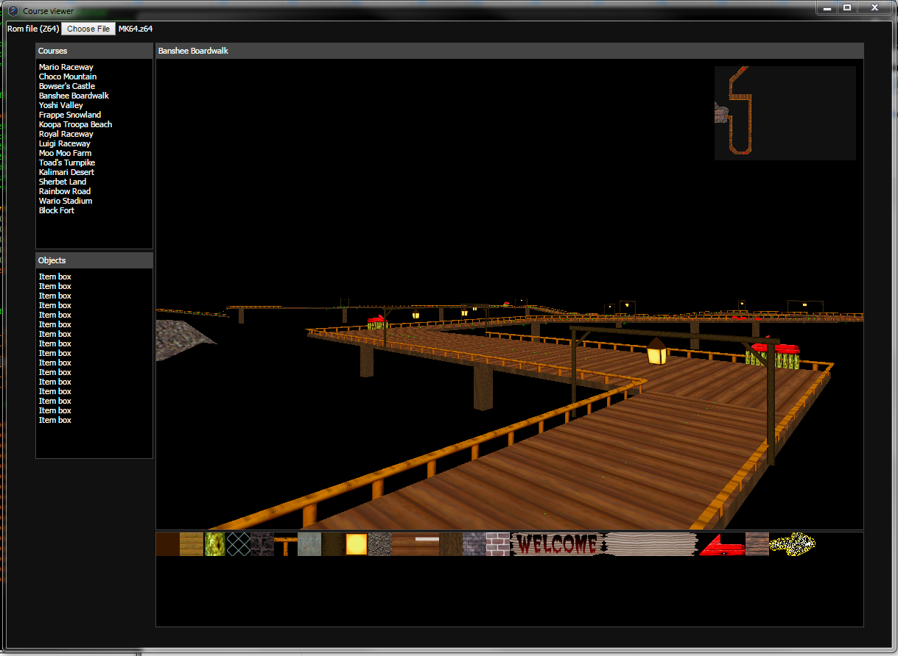

# mk64project
Mario Kart 64 ROM documentation, extractor, course viewer

To extract, name an MK64 rom "MK64.z64", put it in the directory of the tool and run "_run.bat". Level data will be extracted to the directory "mk64dump".

Course viewer:

Kart Viewer:

